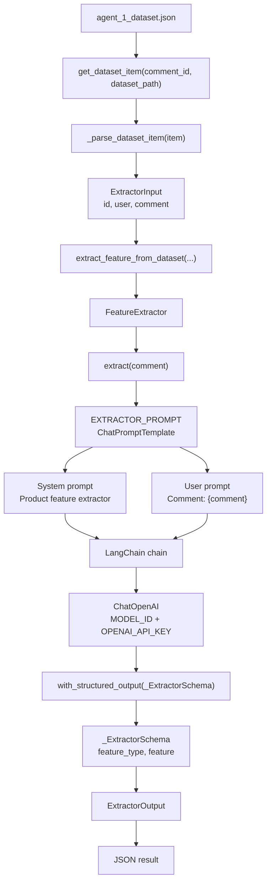
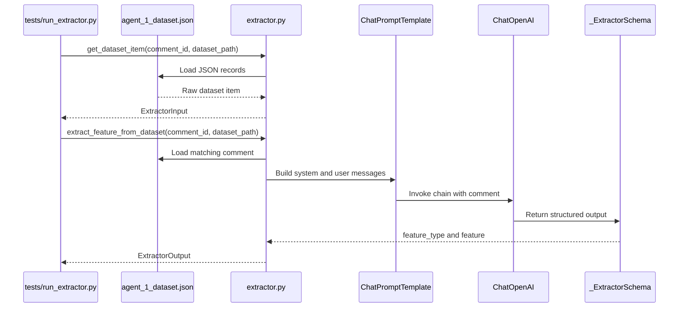

# Agent 1 Architecture

Agent 1 extracts a product feature from a user comment.

It receives:
- `id`
- `user`
- `comment`

It returns:
- `feature_type`
- `feature`

## Runtime Flow

## Main Components

| Component | Role |
| --- | --- |
| `ExtractorInput` | Internal input object containing `id`, `user`, and `comment`. |
| `ExtractorOutput` | Internal output object containing `feature_type` and `feature`. |
| `_ExtractorSchema` | Pydantic schema used by LangChain structured output. |
| `EXTRACTOR_PROMPT` | LangChain prompt containing the system instruction and comment input. |
| `FeatureExtractor` | Service class that builds the chain and invokes the LLM. |
| `ChatOpenAI` | LangChain OpenAI wrapper using `OPENAI_API_KEY` and `MODEL_ID`. |

