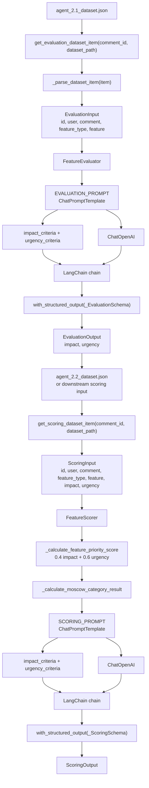
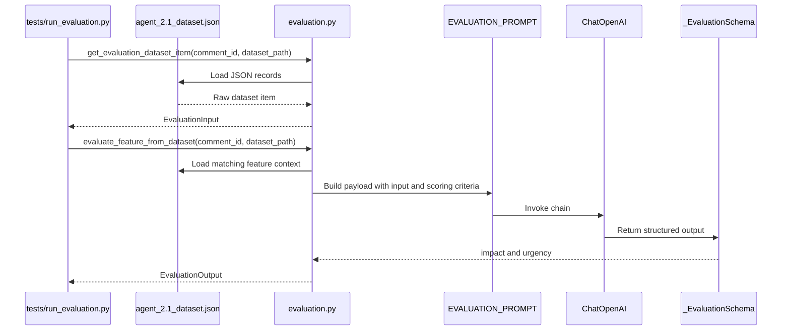
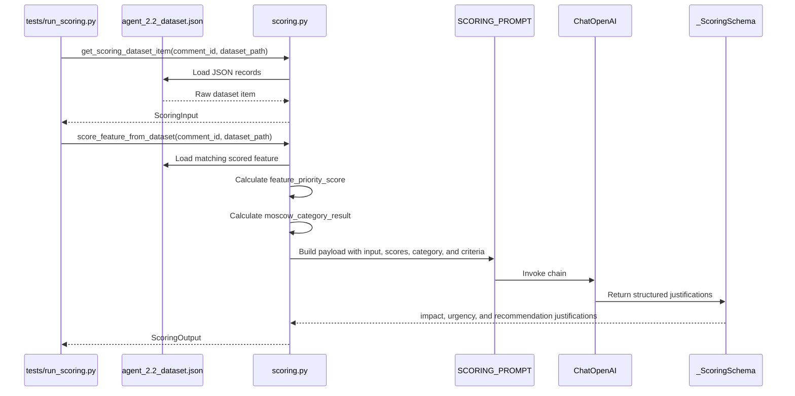

# Agent 2 Architecture (evaluation + scoring)

Agent 2 evaluates and prioritizes an extracted product feature.

It is split into two services:
- Agent 2.1 evaluates `impact` and `urgency`.
- Agent 2.2 computes prioritization values and generates justifications.

## Inputs

Agent 2.1 receives:
- `id`
- `user`
- `comment`
- `feature_type`
- `feature`

Agent 2.2 receives:
- `id`
- `user`
- `comment`
- `feature_type`
- `feature`
- `impact`
- `urgency`

## Outputs

Agent 2.1 returns:
- `impact`
- `urgency`

Agent 2.2 returns:
- `impact_justification`
- `urgency_justification`
- `feature_priority_score`
- `moscow_category_result`
- `feature_recommendation_justification`



## Agent 2.1 Runtime Flow



## Agent 2.2 Runtime Flow



## Main Components

| Component | Role |
| --- | --- |
| `EvaluationInput` | Input object for impact and urgency evaluation. |
| `EvaluationOutput` | Output object containing `impact` and `urgency`. |
| `_EvaluationSchema` | Pydantic schema used by LangChain structured output for Agent 2.1. |
| `EVALUATION_PROMPT` | LangChain prompt containing the evaluation instruction and criteria payload. |
| `FeatureEvaluator` | Service class that evaluates `impact` and `urgency` with the LLM. |
| `ScoringInput` | Input object for prioritization and justification generation. |
| `ScoringOutput` | Output object containing justifications, priority score, and MoSCoW category. |
| `_ScoringSchema` | Pydantic schema used by LangChain structured output for Agent 2.2 justifications. |
| `SCORING_PROMPT` | LangChain prompt containing the scoring justification instruction and criteria payload. |
| `FeatureScorer` | Service class that computes priority values and invokes the LLM for justifications. |
| `ChatOpenAI` | LangChain OpenAI wrapper using `OPENAI_API_KEY` and `MODEL_ID`. |

## Deterministic Rules

Agent 2.2 computes these values locally before calling the LLM:

```text
feature_priority_score = 0.4 * impact + 0.6 * urgency
```

```text
feature_priority_score >= 4.5 -> Must have
feature_priority_score >= 3.5 -> Should have
feature_priority_score >= 2.5 -> Could have
feature_priority_score < 2.5  -> Won't have for now
```

