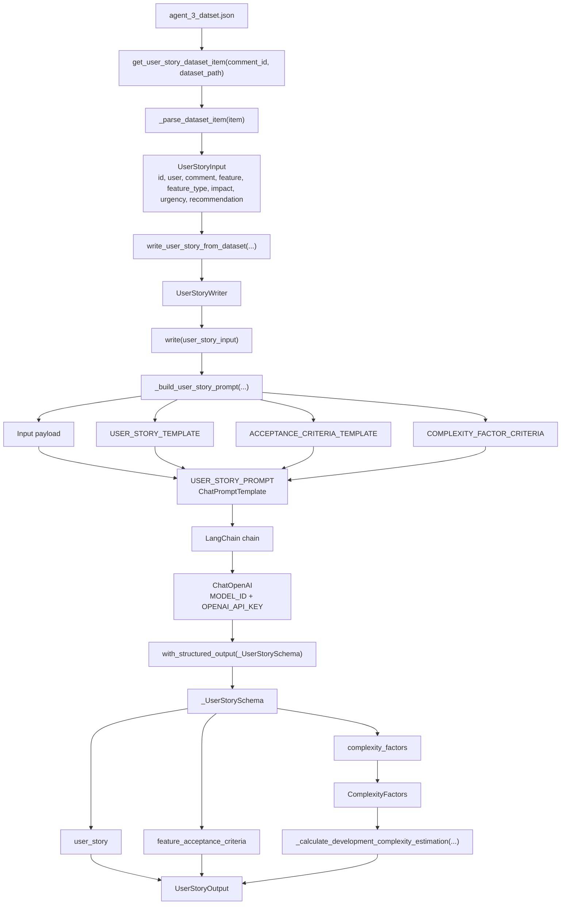
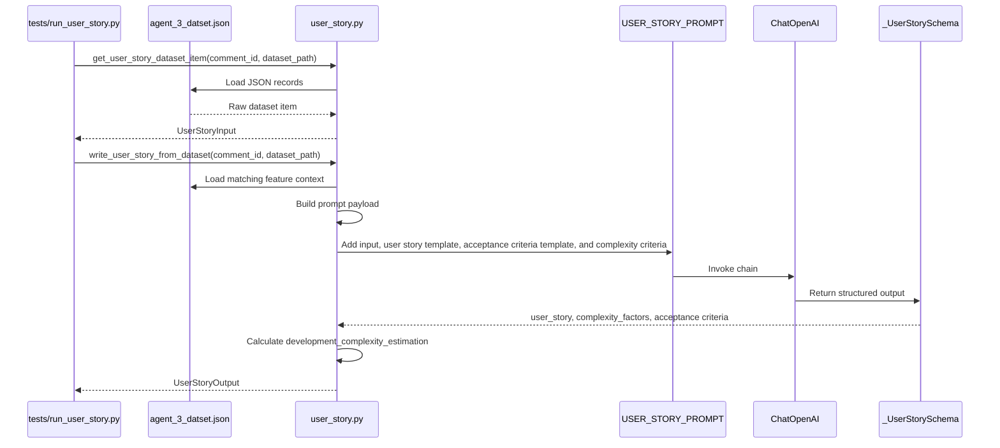

# Agent 3 Architecture (user_story)

Agent 3 writes the user story, estimates implementation complexity, and generates acceptance criteria.

It receives:
- `id`
- `user`
- `comment`
- `feature`
- `feature_type`
- `impact`
- `urgency`
- `feature_recommendation_justification`

It returns:
- `user_story`
- `complexity_factors`
- `development_complexity_estimation`
- `feature_acceptance_criteria`



## Runtime Flow



## Main Components

| Component | Role |
| --- | --- |
| `UserStoryInput` | Input object containing the feature context and prioritization recommendation. |
| `UserStoryOutput` | Output object containing the generated story, complexity, and acceptance criteria. |
| `ComplexityFactors` | Internal object containing five binary complexity flags. |
| `_ComplexityFactorsSchema` | Pydantic schema for structured complexity factor output. |
| `_UserStorySchema` | Pydantic schema used by LangChain structured output for Agent 3. |
| `USER_STORY_PROMPT` | LangChain prompt containing the system instruction and JSON payload. |
| `USER_STORY_TEMPLATE` | Template used to guide the generated user story. |
| `ACCEPTANCE_CRITERIA_TEMPLATE` | Template used to generate exactly three acceptance criteria. |
| `COMPLEXITY_FACTOR_CRITERIA` | Criteria used by the LLM to set binary complexity factors. |
| `UserStoryWriter` | Service class that builds the chain, invokes the LLM, and returns the final output. |
| `ChatOpenAI` | LangChain OpenAI wrapper using `OPENAI_API_KEY` and `MODEL_ID`. |

## Complexity Rules

Agent 3 asks the LLM to return five binary complexity factors:

```text
backend_changes
frontend_changes
data_model_changes
security_constraints
integration_dependencies
```

Each factor is a binary value:
- `0` means this type of work is not expected.
- `1` means this type of work is expected.

The local complexity score is the sum of the five factors:

```text
complexity_score =
  backend_changes
  + frontend_changes
  + data_model_changes
  + security_constraints
  + integration_dependencies
```

Because there are five binary factors, the score can only be between `0` and `5`.

Examples:

```text
backend_changes = 1
frontend_changes = 1
data_model_changes = 0
security_constraints = 0
integration_dependencies = 0

complexity_score = 1 + 1 + 0 + 0 + 0 = 2
development_complexity_estimation = Low
```

```text
backend_changes = 1
frontend_changes = 1
data_model_changes = 1
security_constraints = 1
integration_dependencies = 0

complexity_score = 1 + 1 + 1 + 1 + 0 = 4
development_complexity_estimation = Medium
```

```text
backend_changes = 1
frontend_changes = 1
data_model_changes = 1
security_constraints = 1
integration_dependencies = 1

complexity_score = 1 + 1 + 1 + 1 + 1 = 5
development_complexity_estimation = High
```

Agent 3 then maps the local score to `development_complexity_estimation`:

```text
0-2 factors -> Low complexity
3-4 factors -> Medium complexity
5 factors   -> High complexity
```

This is a simple additive model. All factors currently have the same weight, so a security constraint counts the same as a frontend change or an integration dependency.

## Acceptance Criteria Rules

Agent 3 asks the LLM to return exactly three `feature_acceptance_criteria`:

```text
1. Core functionality
2. Constraint or validation
3. Real-world condition
```

Each criterion must be:
- specific and testable
- based on the user comment
- one sentence
- maximum 20 words
- prefixed by `A user can` or `The system`
- free of implementation details
