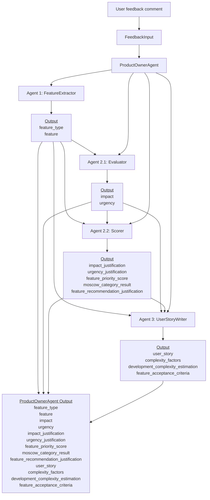
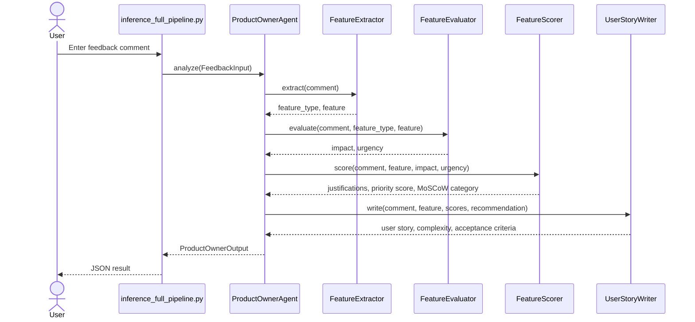

# Full Pipeline Architecture

The full pipeline is orchestrated by `ProductOwnerAgent` in
`src/user_story_generator_agent/services/orchestrator.py`.

It takes one user feedback comment as input and returns a complete Product Owner
analysis: extracted feature, prioritization, recommendation, user story,
complexity estimation, and acceptance criteria.

## High-Level Flow



## Runtime Entry Point

The manual inference script is:

```text
tests/inference/inference_full_pipeline.py
```

It accepts a user comment either from the command line or from an interactive
prompt.

```bash
python tests/inference/inference_full_pipeline.py
```

Example comment:

```text
We need role-based permissions because managing access across large teams is risky right now. Admin control is not granular enough.
```

The script builds:

```python
FeedbackInput(
    id=1,
    user="manual_input",
    comment=comment,
)
```

Then it calls:

```python
analyze_feedback(feedback)
```

## Sequence Diagram



## Pipeline Stages

### 1. Feedback Input

Input type:

```python
FeedbackInput
```

Fields:

```text
id: int
user: str
comment: str
```

The full pipeline only requires a comment from the user. The inference script
uses a default id and user for manual input.

### 2. Agent 1: Feature Extraction

Implementation:

```text
src/user_story_generator_agent/services/extractor.py
```

Responsibility:

- classify the feedback as `feature_request`, `bug_report`, or `improvement`
- extract a short product-focused feature name

Output:

```python
ExtractorOutput(
    feature_type="feature_request",
    feature="role-based permissions",
)
```

### 3. Agent 2.1: Feature Evaluation

Implementation:

```text
src/user_story_generator_agent/services/evaluation.py
```

Responsibility:

- assign an impact score from 1 to 5
- assign an urgency score from 1 to 5

The evaluator receives:

- original comment
- extracted feature type
- extracted feature name
- impact criteria
- urgency criteria

Output:

```python
EvaluationOutput(
    impact="5",
    urgency="4",
)
```

### 4. Agent 2.2: Scoring And Recommendation

Implementation:

```text
src/user_story_generator_agent/services/scoring.py
```

Responsibility:

- generate the impact justification
- generate the urgency justification
- compute the priority score
- compute the MoSCoW category
- generate the prioritization recommendation

The priority score is deterministic:

```text
feature_priority_score = 0.4 * impact + 0.6 * urgency
```

The MoSCoW category is deterministic:

```text
4.5 to 5.0  -> Must have
3.5 to 4.49 -> Should have
2.5 to 3.49 -> Could have
below 2.5   -> Won't have for now
```

Output:

```python
ScoringOutput(
    impact_justification="...",
    urgency_justification="...",
    feature_priority_score=4.4,
    moscow_category_result="Should have",
    feature_recommendation_justification="...",
)
```

### 5. Agent 3: User Story Writing

Implementation:

```text
src/user_story_generator_agent/services/user_story.py
```

Responsibility:

- generate one user story
- generate exactly three acceptance criteria
- estimate complexity factors
- compute the final development complexity level

The user story follows this format:

```text
As a [user type], I want [feature], so that [impact and urgency outcome].
```

The acceptance criteria rules are:

- exactly three criteria
- each criterion starts with `A user can` or `The system`
- each criterion is one sentence
- each criterion has a maximum of 20 words
- criteria should be specific and testable

Complexity factors:

```text
backend_changes
frontend_changes
data_model_changes
security_constraints
integration_dependencies
```

The development complexity is deterministic:

```text
0 to 2 active factors -> Low
3 to 4 active factors -> Medium
5 active factors      -> High
```

Output:

```python
UserStoryOutput(
    user_story="As an admin, I want role-based permissions, so that I can securely manage access across large teams.",
    complexity_factors=ComplexityFactors(...),
    development_complexity_estimation="Medium",
    feature_acceptance_criteria=[...],
)
```

## Final Output

The orchestrator merges all intermediate outputs into:

```python
ProductOwnerOutput
```

Fields:

```text
feature_type
feature
impact
urgency
impact_justification
urgency_justification
feature_priority_score
moscow_category_result
feature_recommendation_justification
user_story
complexity_factors
development_complexity_estimation
feature_acceptance_criteria
```

Example final output shape:

```json
{
  "feature_type": "feature_request",
  "feature": "role-based permissions",
  "impact": "5",
  "urgency": "4",
  "impact_justification": "...",
  "urgency_justification": "...",
  "feature_priority_score": 4.4,
  "moscow_category_result": "Should have",
  "feature_recommendation_justification": "...",
  "user_story": "...",
  "complexity_factors": {
    "backend_changes": 1,
    "frontend_changes": 1,
    "data_model_changes": 1,
    "security_constraints": 1,
    "integration_dependencies": 0
  },
  "development_complexity_estimation": "Medium",
  "feature_acceptance_criteria": [
    "A user can assign specific roles to team members.",
    "The system restricts actions based on assigned permissions.",
    "The system applies role changes immediately after updates."
  ]
}
```

## Design Notes

- The pipeline is split into specialized agents to keep each prompt focused.
- LLM outputs are constrained with structured Pydantic schemas.
- Critical business calculations are deterministic instead of generated by the
  model.
- The orchestrator owns the data flow between agents.
- The final output is a single structured object that can be used by a CLI,
  API, UI, or evaluation script.
