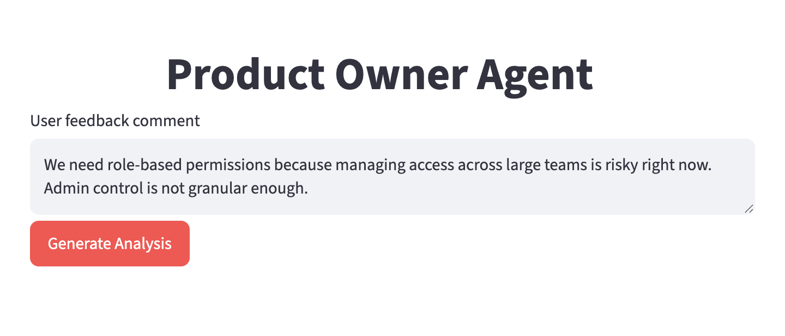
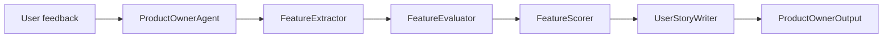
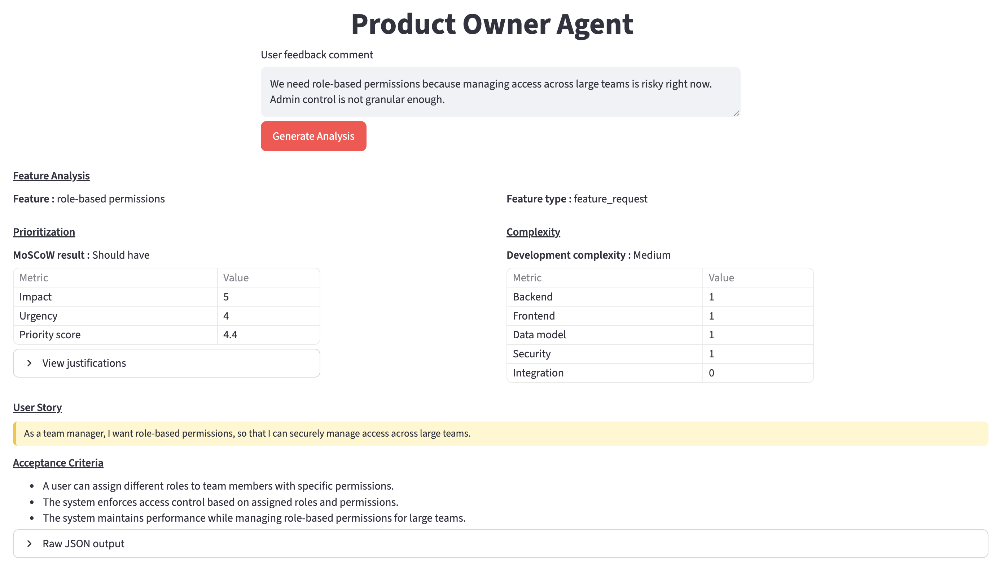
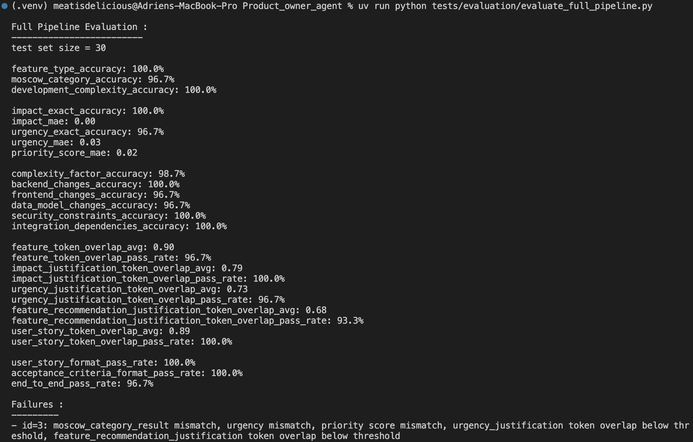

# Product Owner Agent

AI assistant for Product Owners. It analyzes a user feedback comment, extracts the requested feature, evaluates priority, recommends a MoSCoW category, and generates a user story with acceptance criteria and complexity estimation.

<p align="center">
  
</p>

The project was built according to the specifications described in [`technical_test_agent_builder_ai.md`](technical_test_agent_builder_ai.md).

## What It Does

Given a feedback comment such as:

```text
We need role-based permissions because managing access across large teams is risky right now. Admin control is not granular enough.
```

The agent returns:

- feature type and extracted feature
- impact and urgency scores
- priority score and MoSCoW result
- recommendation justifications
- user story
- acceptance criteria
- development complexity estimation

## Architecture

The full pipeline is orchestrated by `ProductOwnerAgent` in:

```text
src/user_story_generator_agent/services/orchestrator.py
```

Architecture diagram:



Main responsibilities:

- `extractor.py`: classifies the feedback and extracts the feature name.
- `evaluation.py`: estimates impact and urgency.
- `scoring.py`: computes priority score, MoSCoW result, and justifications.
- `user_story.py`: writes the user story, acceptance criteria, and complexity estimate.
- `streamlit_app.py`: provides the web UI.

More detail is available in:

```text
2_documentation/architecture_diagrams/full_pipeline_architecture.md
```

## Tech Stack

- Python 3.12+
- Streamlit for the UI
- OpenAI API through `langchain-openai`
- `python-dotenv` for local environment variables
- `uv` for dependency management

## Installation

Install dependencies with `uv`:

```bash
uv sync
```

Create a `.env` file at the project root:

```bash
OPENAI_API_KEY=your_openai_api_key
MODEL_ID=your_model_id
```

Example `MODEL_ID` values depend on the models available to your OpenAI account.

## Run The Streamlit App

```bash
uv run streamlit run src/user_story_generator_agent/ui/streamlit_app.py
```

Then open the local Streamlit URL shown in the terminal, usually:

```text
http://localhost:8501
```

## Run The Pipeline From The Terminal

Interactive mode:

```bash
uv run python tests/inference/inference_full_pipeline.py
```

With a direct comment:

```bash
uv run python tests/inference/inference_full_pipeline.py "We need role-based permissions because managing access across large teams is risky right now."
```

Dataset-based full pipeline example:

```bash
uv run python tests/run_full_pipeline.py
```

## Result Example

The Streamlit app displays the full Product Owner analysis in a compact UI:

<p align="center">
  
</p>

Metrics on the dataset with 30 comment/expected-output pairs:

<p align="center">
  
</p>

## Project Structure

```text
Product_owner_agent/
├── 1_Data/
│   └── readme_imgs/
├── 2_documentation/
│   ├── architecture_diagrams/
│   └── technical_documentation/
├── src/
│   └── user_story_generator_agent/
│       ├── context/
│       ├── services/
│       └── ui/
└── tests/
    ├── evaluation/
    ├── inference/
    └── unit_tests/
```

## Model Output

The final pipeline output includes:

```text
feature_type
feature
impact
urgency
impact_justification
urgency_justification
feature_priority_score
moscow_category_result
feature_recommendation_justification
user_story
complexity_factors
development_complexity_estimation
feature_acceptance_criteria
```

## Scoring abstract

The priority score is deterministic:

```text
priority_score = 0.4 * impact + 0.6 * urgency
```

The MoSCoW result is derived from the priority score:

```text
4.5 to 5.0   -> Must have
3.5 to 4.49  -> Should have
2.5 to 3.49  -> Could have
below 2.5    -> Won't have for now
```
